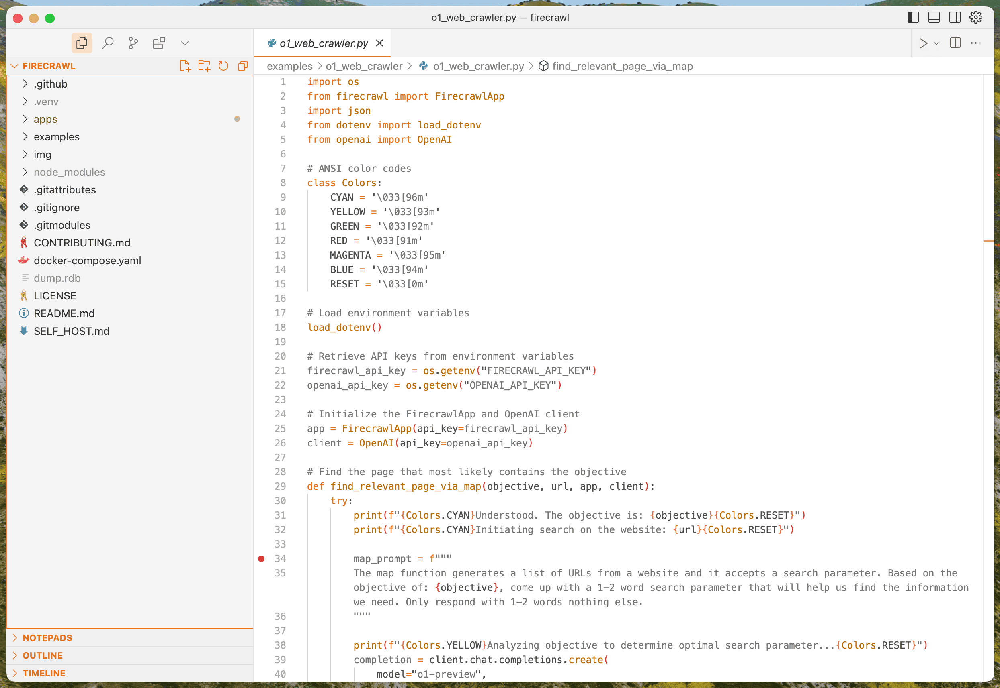

# A Firecrawl theme for VS Code, Cursor, and Windsurf 🔥

## Features

Firecrawl Theme is a carefully crafted theme available in both Dark and Light variants:

- **Firecrawl Theme** - A sleek dark theme with vivid orange highlights
- **Firecrawl Theme Light** - A clean light theme that maintains the same orange accent colors

## Installation

1. Install the theme from the VS Code Marketplace or Extensions panel
2. Go to `Preferences > Color Theme`
3. Select either "Firecrawl Theme" for dark mode or "Firecrawl Theme Light" for light mode

## Screenshot

